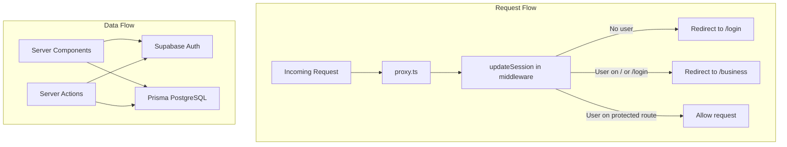
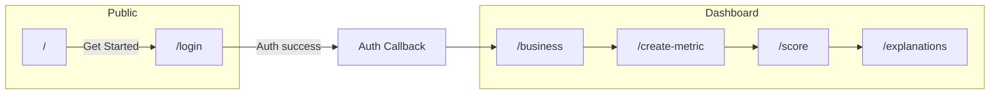

# Application Flow

## Tech Stack

- **Framework**: Next.js 16 (App Router)
- **UI**: React 19, Tailwind CSS, Radix UI
- **Auth**: Supabase (session, OAuth)
- **Database**: PostgreSQL via Prisma
- **LLM**: OpenRouter (for AI explanations)

## Architecture Overview



## Route Structure

Routes are centralized in [lib/routes.ts](../lib/routes.ts):

| Route | Path | Purpose |
|-------|------|---------|
| home | `/` | Landing page |
| login | `/login` | Sign in / sign up |
| business | `/business` | Business profile onboarding |
| createMetric | `/create-metric` | Create financial metric |
| metricScore | `/score` | View latest health score |
| explanations | `/explanations` | AI-generated explanations |

## User Journey



1. **Landing** (`/`) — Public page with "Get Started" leading to `/login`
2. **Login** (`/login`) — Supabase `signInWithPassword` or OAuth ([lib/auth/actions.ts](../lib/auth/actions.ts))
3. **Auth callback** — [app/auth/callback/route.ts](../app/auth/callback/route.ts) exchanges code for session, then redirects to `/business`
4. **Business** (`/business`) — Create or edit business profile
5. **Create metric** (`/create-metric`) — Enter revenue, expenses, cash, top customer %; score computed via [lib/health-score/healthScore.ts](../lib/health-score/healthScore.ts)
6. **Score** (`/score`) — View latest metric and health score
7. **Explanations** (`/explanations`) — AI-generated analysis via OpenRouter

## Auth Flow

Session handling is in [lib/supabase/middleware.ts](../lib/supabase/middleware.ts) (`updateSession`):

- **No user** on any path except `/` and `/login` → redirect to `/login`
- **Authenticated user** on `/` or `/login` → redirect to `/business`
- Auth uses Supabase cookies via `createServerClient` from `@supabase/ssr`

Next.js uses `experimental.testProxy: true` ([next.config.ts](../next.config.ts)), so [proxy.ts](../proxy.ts) delegates to `updateSession` instead of a root `middleware.ts`.

## Data Model

```
Business (userId) ──┬── Metric (revenue, expenses, score, scoreStatus)
                    └── LLMExplanation (per Metric)
```

- **Business**: Profile (name, type, city, sales range, currency) linked to Supabase `userId`
- **Metric**: Financial inputs plus computed `score` and `scoreStatus` (GREEN/YELLOW/RED)
- **LLMExplanation**: AI analysis stored per metric

## Data Flow

- **Server Components** load data via [app/(dashboard)/_lib/service.ts](../app/(dashboard)/_lib/service.ts) and [lib/prisma/services.ts](../lib/prisma/services.ts)
- **Server Actions** in `*_lib/actions.ts` handle create/update (business, metric, explanations)
- No dedicated REST API — mutations go through Server Actions with `revalidatePath` and `redirect`
