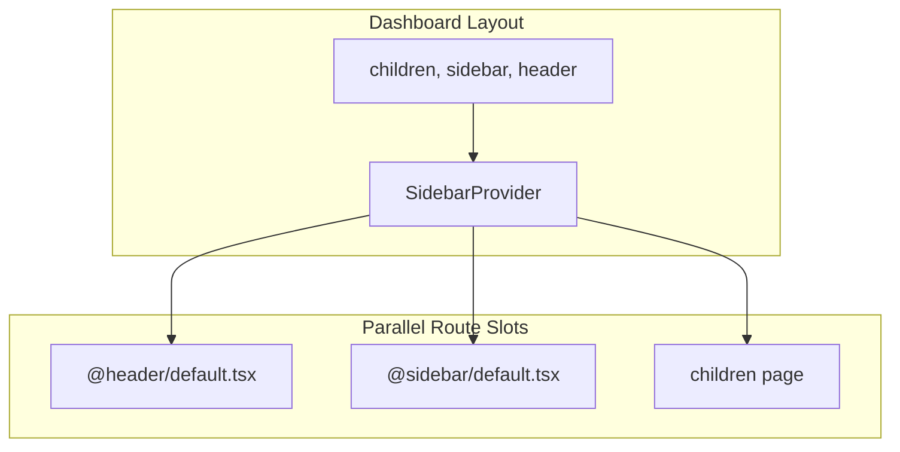

# UI Implementation — Parallel Routes (Header and Sidebar)

The dashboard uses [Next.js parallel routes](https://nextjs.org/docs/app/building-your-application/routing/parallel-routes) to render the header and sidebar as separate slots alongside the main content.

## Layout Structure



## File Structure

```
app/(dashboard)/
├── layout.tsx              # Receives children, sidebar, header
├── @header/
│   ├── default.tsx         # Header slot
│   ├── default.test.tsx
│   ├── _components/
│   │   ├── sidebar-trigger/
│   │   └── user-menu/
│   └── _lib/
│       ├── test.ids.ts
│       └── types.ts
├── @sidebar/
│   ├── default.tsx         # Sidebar slot
│   ├── default.test.tsx
│   ├── _components/
│   │   └── sidebar-item/
│   └── _lib/
│       ├── types.ts
│       └── test.ids.ts
├── business/
├── create-metric/
├── score/
└── explanations/
```

## Layout Props

[layout.tsx](../app/(dashboard)/layout.tsx) receives three props from Next.js:

| Prop | Source | Purpose |
|------|--------|---------|
| `children` | Page content | Main article (e.g. `/business`, `/score`) |
| `header` | `@header/default.tsx` | Sticky header (logo, sidebar trigger, user menu) |
| `sidebar` | `@sidebar/default.tsx` | Collapsible left navigation |

```tsx
const DashboardLayout = ({ children, sidebar, header }: DashboardLayoutProps) => (
  <SidebarProvider>
    <div className='flex flex-col w-full'>
      {header}
      <div className='flex w-full'>
        <aside>{sidebar}</aside>
        <main className='flex-1 overflow-auto'>
          <article className='max-w-xl mx-auto py-10 px-4'>{children}</article>
        </main>
      </div>
    </div>
  </SidebarProvider>
)
```

## Path Aliases

The `@header` and `@sidebar` aliases in [tsconfig.json](../tsconfig.json) map to the parallel route folders:

```json
"@header/*": ["./app/(dashboard)/@header/*"],
"@sidebar/*": ["./app/(dashboard)/@sidebar/*"]
```

This keeps imports stable when refactoring and separates header/sidebar concerns from the rest of the app.

## Header Slot

[app/(dashboard)/@header/default.tsx](../app/(dashboard)/@header/default.tsx):

- **SidebarTrigger** — Toggles the sidebar (collapsible)
- **Logo** — Brand/logo
- **UserMenu** — Async user menu (avatar, sign out)

## Sidebar Slot

[app/(dashboard)/@sidebar/default.tsx](../app/(dashboard)/@sidebar/default.tsx):

- Uses `Sidebar` from shadcn/ui with `collapsible='icon'`
- **SidebarItem** — Links for Business, Create Metric, Score, Explanations
- Routes come from [lib/routes.ts](../lib/routes.ts)
