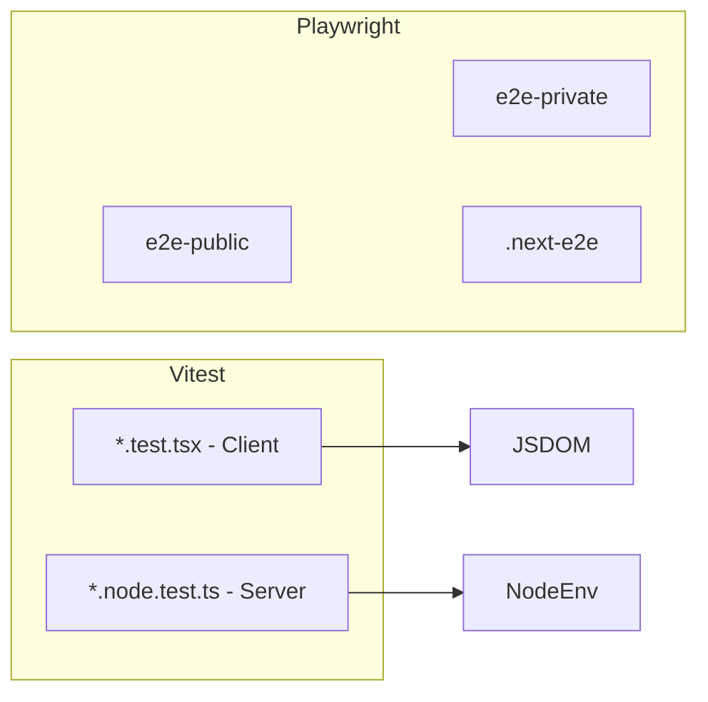

# Testing Strategy

The project uses **Vitest** for unit/integration tests and **Playwright** for end-to-end tests, with separate Next.js build folders for dev and E2E.

## Overview



## Separate Next.js Folders

| Environment | Dist dir | Script | Purpose |
|-------------|----------|--------|---------|
| Development | `.next` | `npm run dev` | Local development |
| E2E | `.next-e2e` | `npm run dev:e2e` | Playwright tests (isolated build) |

[next.config.ts](../next.config.ts) sets `distDir` based on `APP_ENV`:

```ts
distDir: env.APP_ENV === 'test' ? '.next-e2e' : '.next'
```

Playwright starts the app with `dev:e2e`, which uses `NEXT_DIST_DIR=.next-e2e` so E2E runs against a dedicated build. This avoids conflicts between dev and test builds.

## Vitest Configuration

[vitest.config.ts](../vitest.config.ts) defines two projects:

### 1. Client Tests

- **Pattern**: `**/*.test.{js,ts,jsx,tsx}` (excludes `*.node.test.*`)
- **Environment**: `jsdom`
- **Setup**: [vitest.client.setup.ts](../vitest.client.setup.ts)
- **Plugins**: `@vitejs/plugin-react`, `vite-tsconfig-paths`
- **Aliases**: `@testing-library/react` → custom test-utils with slot queries

### 2. Server Tests

- **Pattern**: `**/*.node.test.{js,ts}`
- **Environment**: `node`
- **Setup**: [vitest.server.setup.ts](../vitest.server.setup.ts)

Run all tests:

```bash
npm run test
```

## Testing Server Components / Server Logic

Server components and server-only code (async RSC, env validation, etc.) are tested with the **server** project.

### Approach

1. **File naming**: Use `*.node.test.ts` so Vitest runs them in the server project.
2. **Environment**: Node (no DOM). Use `vi.resetModules()` and dynamic `import()` to control module loading and env vars.
3. **No RSC render**: The focus is on server logic. RSC rendering is not exercised directly; instead, we test the data loaders, env validation, and utilities they use.

### Example: Env Validation

[lib/env/env.node.test.ts](../lib/env/env.node.test.ts) tests `createEnv` in Node:

```ts
it('validate correctly for development environment', async () => {
  setEnv('development')
  const { env } = await import('./env')
  expect(env.APP_ENV).toBe('development')
  // ...
})
```

- `setEnv()` sets `process.env.*_DEVELOPMENT`, etc.
- `await import('./env')` loads the module under test with that env.
- Assertions validate parsed values and error cases.

### Testing Components That Include Async RSC Children

Components like Header that render async children (e.g. `UserMenu`) are tested by **mocking** the async parts and asserting the sync shell. See [@header/default.test.tsx](../app/(dashboard)/@header/default.test.tsx):

```tsx
vi.mock('@header/_components/user-menu', () => ({ UserMenu: vi.fn() }))
// ...
it('renders the header with all its components', () => {
  render(<Header />)
  expect(vi.mocked(UserMenu)).toHaveBeenCalledTimes(1)
})
```

This verifies composition without resolving async RSC in Vitest.

## Mocking OpenRouter API Calls

The app uses OpenRouter for LLM-generated explanations. Tests mock these calls at two levels: **Vitest** (unit) and **Playwright** (E2E).

### Vitest: Mock `runLLM`

[app/(dashboard)/explanations/_lib/actions.test.ts](../app/(dashboard)/explanations/_lib/actions.test.ts) mocks the OpenRouter module:

```ts
vi.mock('@/lib/openrouter/openrouter', () => ({
  runLLM: vi.fn(),
}))
```

Then, per test:

```ts
// Success case
vi.mocked(runLLM).mockResolvedValue('mock_explanation')

// Failure case
vi.mocked(runLLM).mockRejectedValue('LLM failed')
```

This avoids real HTTP calls and lets you assert that `generateAnalysis` calls `runLLM`, persists results to Prisma, and surfaces errors correctly.

### Playwright: Mock via `next.onFetch`

E2E tests run against a real app. OpenRouter calls must be intercepted at the network layer. [e2e/tests/explanations.spec.ts](../e2e/tests/explanations.spec.ts) uses Next.js testmode's `next.onFetch`:

```ts
import { OPENROUTER_URL } from '@/lib/openrouter/openrouter'

test.beforeEach(async ({ next }) => {
  const mockExplanation = 'Mocked explanation'

  next.onFetch(async request => {
    if (request.url.includes(OPENROUTER_URL)) {
      return new Response(JSON.stringify({
        choices: [{ message: { content: mockExplanation } }]
      }), { status: 200, headers: { 'Content-Type': 'application/json' } })
    }
    return fetch(request)
  })
})
```

`OPENROUTER_URL` is exported from [lib/openrouter/openrouter.ts](../lib/openrouter/openrouter.ts) (`https://openrouter.ai/api/v1/chat/completions`). The mock returns a completion-shaped JSON; other requests are passed through.

**Note**: The mock must run in `beforeEach` before any auth/navigation, to avoid interfering with the authentication flow.

## Playwright E2E

### Structure

```
e2e/
├── auth.setup.ts          # Auth state for e2e-private
├── global-setup.ts
├── global-teardown.ts
├── lib/
├── pages/                 # Page Object Model
├── fixtures/
└── tests/
    ├── *.public.spec.ts   # e2e-public (no auth)
    └── *.spec.ts          # e2e-private (requires auth)
```

### Projects

| Project | Auth | Match |
|---------|------|-------|
| e2e-public | None | `**/*.public.spec.ts` |
| setup | — | `**/auth.setup.ts` |
| e2e-private | Yes (depends on setup) | `**/*.spec.ts` (excludes public) |

### Config

[playwright.config.ts](../playwright.config.ts) uses `next/experimental/testmode/playwright` with:

- `testDir: './e2e'`
- `webServer` → `npm run dev:e2e` with `.next-e2e`
- `.env.test` loaded before config

### Run E2E

```bash
npm run test:e2e
npm run test:e2e:ui
npm run test:e2e:report
```

## Summary

| Layer | Tool | Pattern | Notes |
|-------|------|---------|-------|
| Client components | Vitest | `*.test.tsx` | jsdom, RTL, mocks for async children |
| Server logic / env | Vitest | `*.node.test.ts` | Node env, dynamic imports |
| Full user flows | Playwright | `e2e/tests/*.spec.ts` | Separate `.next-e2e` build |

## References (from code comments)

| File | Comment |
|------|---------|
| [lib/testing-library/test-utils.ts](../lib/testing-library/test-utils.ts) | Note: [Testing Library setup](https://testing-library.com/docs/react-testing-library/setup#add-custom-queries). Uses alias to avoid clashes with `window.screen`. |
| [lib/testing-library/slot-queries.ts](../lib/testing-library/slot-queries.ts) | Note: Uses original RTL types. Custom `data-slot` query for shadcn/ui components. |
| [lib/env/env.ts](../lib/env/env.ts) | Note: Use relative paths so Prisma can resolve the file. Map db keys by suffix (e.g. `DATABASE_URL_DEVELOPMENT`). |
| [lib/openrouter/openrouter.ts](../lib/openrouter/openrouter.ts) | Alternative models commented: `meta-llama/llama-3.3-70b-instruct`, `google/gemini-2.0-flash-exp`, etc. |
| [lib/health-score/healthScore.ts](../lib/health-score/healthScore.ts) | Zero expenses returns 0 (suspended/erroneous state). |
| [app/(dashboard)/@header/default.test.tsx](../app/(dashboard)/@header/default.test.tsx) | Note: Test composition by mocking async children (e.g. UserMenu); RSC render not exercised. |
| [e2e/tests/explanations.spec.ts](../e2e/tests/explanations.spec.ts) | Note: Mock OpenRouter responses in `beforeEach` to avoid interfering with auth. |
| [e2e/tests/business.spec.ts](../e2e/tests/business.spec.ts) | Note: Assert business creation after URL change so backend has time to create the business. |
| [e2e/fixtures/user.fixture.ts](../e2e/fixtures/user.fixture.ts) | Note: Alternative auth approach for the user fixture—provided as reference only. Ensure login was successful before proceeding (`waitForURL`). Optional: verify a specific element exists on the dashboard. For future optimizations: use `uuid()` for per-worker unique email instead of shared `EMAIL`. |
| [e2e/global-setup.ts](../e2e/global-setup.ts) | Note: Uncomment `stdio: 'inherit'` to see setup command output. |
| [e2e/supabase/config.toml](../e2e/supabase/config.toml) | Note: Set env vars in `.env.test`; `project_id` and port set for e2e isolation. |
| [playwright.config.ts](../playwright.config.ts) | Note: Uncomment stdout/stderr for MSW messages. |
| [components/ui/sidebar.tsx](../components/ui/sidebar.tsx) | Note: Internal state vs `openProp`; cookie for persistence; keyboard shortcut; `data-state` for styling. |
| [app/(dashboard)/create-metric/_lib/schema.ts](../app/(dashboard)/create-metric/_lib/schema.ts) | Note: Pick Metric fields used by the form. |
